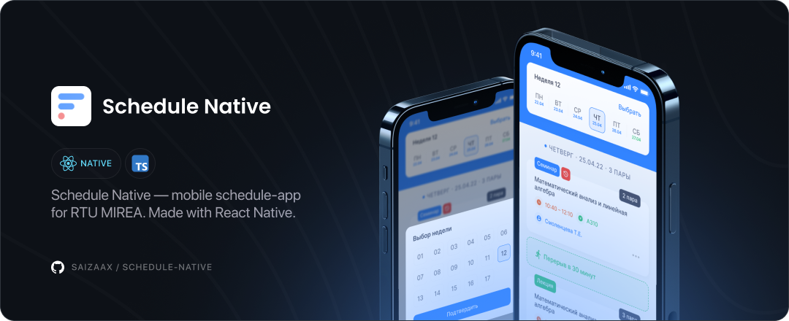

# Schedule Native — Mobile Schedule App for RTU MIREA 📱

[](https://reactnative.dev/)
[](https://reactnative.dev/)
[](https://www.typescriptlang.org/)
[](https://www.typescriptlang.org/)



## Technologies

- `Expo`
- `React Native`
- `TypeScript`
- `Redux`
- `Axios`
- `React Navigation`
- `Lodash`

<br>

### Run develop build

* Download & Install [Expo CLI & Dependencies](https://docs.expo.dev/get-started/installation/)

* Clone this repository
    ```bash
    git clone https://github.com/saizaax/schedule-native
    ```

* Open terminal and navigate to repository directory
    ```bash
    cd schedule-native
    ```

* Install the packages required for the project
    ```bash
    npm i
    ```

* Install [Expo Go](https://docs.expo.dev/get-started/installation/#2-expo-go-app-for-ios-and) on your mobile device
  - [Android](https://play.google.com/store/apps/details?id=host.exp.exponent)
  - [iOS](https://apps.apple.com/app/expo-go/id982107779)

* Start the project with npm
    ```bash
    npm run start
    ```

<br>

## Contacts

2022 • Korolkov Alexander • [@saizaax](https://t.me/saizaax) • [saizaax.off@gmail.com](mailto:saizaax.off@gmail.com)